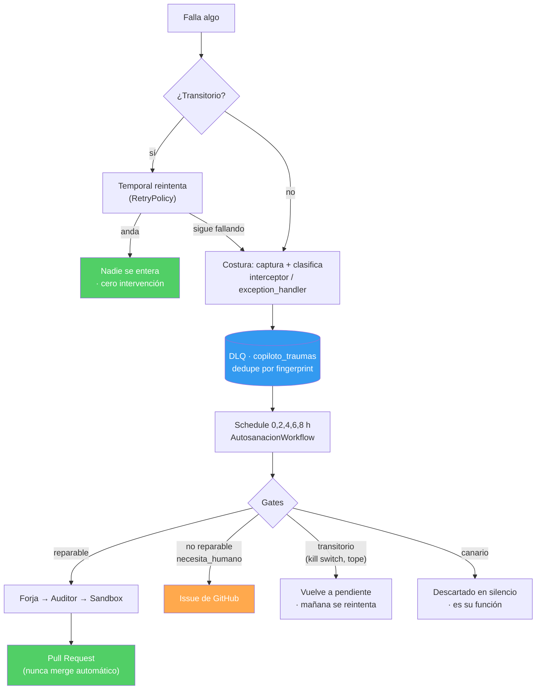

# La cadena completa de manejo de errores — implementación

> **Qué es este documento.** El mapa de cómo el Copiloto detecta, clasifica, absorbe, repara y
> escala sus propios errores — **lo que está implementado y desplegado**, no lo que se planea.
> Cada afirmación apunta a un archivo y una línea verificables.
>
> **Estado:** vigente al **2026-08-02**, verificado contra `main` (`17b8ba2`) y contra el sistema
> vivo en el VPS.
> **Complementa** a [`resumen_manejo_errores_inl.md`](resumen_manejo_errores_inl.md), que describe
> el **marco conceptual** (patrones INL A-1…A-4, niveles L0→L5). Aquel responde *"qué patrón"*;
> este responde *"dónde está el código y qué hace exactamente"*.

---

## 0. Cómo leer este documento

| Si querés… | Andá a |
|---|---|
| Entender el recorrido de un error de punta a punta | §1 y §2 |
| Saber qué pasa con **un** error concreto | §3 (capa por capa) |
| Agregar una feature sin romper nada | **§8 — checklist de feature nueva** |
| Apagar el ciclo en una emergencia | **§7 — superficie de control** |
| Saber si el sistema está sano | §6 — observabilidad y prueba de vida |
| Saber qué NO está resuelto | **§9 — límites conocidos** (leerlo antes de prometer nada) |

---

## 1. La idea en una frase

**El manejo de errores no vive en las features: vive en las costuras.**

Dos líneas montan todo el aparato:

- [`apps/copiloto/worker_b.py:365`](../../apps/copiloto/worker_b.py#L365) —
  `interceptors=[CapturaDeErroresInterceptor(...)]` envuelve **todas** las activities del worker.
- [`apps/copiloto/web.py:556`](../../apps/copiloto/web.py#L556) —
  `registrar_captura_global(app, ...)` envuelve **todos** los endpoints HTTP.

Como envuelven el **borde** y no la función, toda activity o endpoint nuevo hereda el aparato
completo sin que nadie se acuerde de nada. Esa es la razón estructural por la que el sistema no se
degrada a medida que crece la app: no hay disciplina que sostener.

---

## 2. Vista de conjunto



**La propiedad que importa:** cada capa absorbe lo suyo y sólo delega lo que no puede resolver. Un
timeout de Composio muere en la primera capa sin que nadie lo vea; un bug de negocio llega hasta un
PR; un permiso vencido llega hasta una persona. **Nada se pierde en el camino y nada escala de más.**

---

## 3. Las capas, una por una

### L0 · Temporal reintenta lo transitorio

**Dónde:** cada workflow declara su `RetryPolicy`. Ejemplos vivos:
[`afip_factura_workflow.py:59`](../../apps/copiloto/afip_factura_workflow.py#L59) ·
[`afip_anulacion_workflow.py:27`](../../apps/copiloto/afip_anulacion_workflow.py#L27).

```python
RetryPolicy(maximum_attempts=3,
            non_retryable_error_types=["RechazoAfip", "SinCertificado"])
```

Lo importante no es que reintente: es **qué se declara NO reintentable**. Un rechazo de ARCA o un
certificado ausente no mejoran con otro intento — reintentarlos es quemar tiempo y arriesgar efectos
duplicados. Distribución actual en la app: 7 políticas con `maximum_attempts=3`, 2 con `=2`, 4 con
`=1` (sin reintento).

**Consecuencia operativa:** la enorme mayoría de los fallos reales de producción —timeouts, 5xx,
rate limits— **se resuelven acá y nadie se entera nunca**. Es la capa que hace que el volumen de
trabajo humano no escale con el tráfico.

---

### L1 · Las costuras capturan, clasifican y declaran

Dos costuras simétricas, una por cada borde del sistema.

| Borde | Archivo | Qué hace |
|---|---|---|
| Activities (worker) | [`interceptor_errores.py`](../../apps/copiloto/interceptor_errores.py) | declara el tenant, captura la excepción, clasifica y deposita |
| HTTP (front-door) | [`handler_errores_web.py`](../../apps/copiloto/handler_errores_web.py) | idem, sobre `@app.exception_handler(Exception)` |

**Tres reglas de la costura** (documentadas en el propio módulo, `interceptor_errores.py:20-31`):

1. **La excepción original sigue su curso, intacta.** La costura observa; no cambia la semántica.
2. **Registrar nunca puede costar más que el error que se registra.** Si falla el registro, se traga
   ese fallo secundario — nunca el original.
3. **Un error sin categoría se registra igual, marcado.** Ver abajo.

#### La taxonomía: 4 categorías, y ninguna por descarte

[`taxonomia_errores.py`](../../apps/copiloto/taxonomia_errores.py)

| Categoría | Qué significa | Qué se hace |
|---|---|---|
| `infra_error` | transitorio: red, timeout, 5xx, rate limit | reintentar automáticamente |
| `business_error` | el dato o el estado están mal | no reintentar; hace falta un humano o un dato distinto |
| `manual_intervention` | efecto externo que sólo una persona resuelve | bloquear y avisar |
| `cascading` | falló porque su dependencia falló | revisar el padre, no éste |

**La decisión de diseño que sostiene todo: no hay categoría por descarte.** Un error desconocido
levanta `ErrorSinCategoria` en vez de caer en un `else`. Es incómodo a propósito: un
`else: infra_error` se tragaría cualquier excepción nueva y la mandaría a reintentar para siempre.

En las costuras esa excepción **no se propaga** (perdería el primer error de un tipo nuevo, que es
justo el que más importa ver): se registra como `SIN_CATEGORIA`, que es ruidoso, accionable, y **no
es auto-reparable** — falla del lado seguro.

---

### L2 · La DLQ: el error se vuelve un dato consultable

**Tabla:** `uc_factory.copiloto_traumas` · **Store:**
[`trauma_store.py`](../../apps/copiloto/trauma_store.py) · **Fachada:**
[`deposito_traumas.py`](../../apps/copiloto/deposito_traumas.py)

#### El fingerprint es la pieza central

[`fingerprint.py`](../../apps/copiloto/fingerprint.py) — djb2 de 32 bits → **8 caracteres hex**.
Portado byte-a-byte de ARCA (`err00-djb2-hash.ts:28-36`), no reinventado.

Dos decisiones que parecen menores y no lo son:

- **No es un hash criptográfico y no pretende serlo.** Se busca una clave corta, estable, barata y
  **legible en un log**: 8 caracteres que una persona puede grepear y comparar de un vistazo.
- **El mensaje se trunca a 200 caracteres** antes de hashear. Los errores suelen terminar en un id,
  un timestamp o un uuid distinto en cada ocurrencia; sin cortar, cada instancia del mismo fallo
  generaría un fingerprint nuevo y **el defecto se disfrazaría de 40 problemas distintos** — que es
  exactamente lo que hace imposible priorizar.

#### Deduplicación: 500 fallos iguales son UNA fila

```sql
ON CONFLICT (fingerprint) DO UPDATE
   SET dedupe_count = copiloto_traumas.dedupe_count + 1, ...
RETURNING dedupe_count, (xmax = 0) AS insertado
```

`trauma_store.py:109-126`. El `(xmax = 0)` distingue **insertado** de **re-contado** sin una segunda
consulta.

> **Esto es lo que hace que la carga humana no escale con el tráfico.** La unidad de trabajo no es
> "errores", son **fingerprints distintos** — y los fingerprints distintos se agotan: cada bug se
> descubre una vez, después es un duplicado.

#### Estados de un trauma

`pendiente` → `reparacion_propuesta` → `resuelto` · más `descartado` (permanente, no vuelve) y
`fallido`.

#### Cómo se elige el próximo a reparar

`tomar_un_bug_distinto()` (`trauma_store.py:166`):

- `DISTINCT ON (fingerprint)` — no repetir el mismo defecto,
- `ORDER BY dedupe_count DESC` — atacar primero el que más pega,
- `FOR UPDATE SKIP LOCKED` — dos recuperadores en paralelo nunca toman el mismo,
- `LIMIT 1` — **una ejecución = un trauma**.

---

### L3 · El ciclo de auto-reparación

**Disparo:** Temporal Schedule **único y global** `autosanacion-global`
([`ensure_autosanacion_schedules.py`](../../deploy/worker/ensure_autosanacion_schedules.py)) — horas
**0, 2, 4, 6 y 8** (`COPILOTO_AUTOSANACION_HORA` / `_HORA_FIN` / `_PASO_HORAS`). Cinco disparos
diarios, en ventana de baja demanda.

> Hasta el 2026-08-01 era un Schedule **por tenant**: 19 disparos idénticos compitiendo por el mismo
> trabajo cross-tenant. Se unificó porque escalaba mal por construcción.

**El workflow** ([`autosanacion_workflow.py`](../../apps/copiloto/autosanacion_workflow.py)) es
corto y sin estado entre corridas — 7 pasos, cada uno con su presupuesto:

| # | Paso | Timeout | Reintentos | Si dice que no |
|---|---|---|---|---|
| 1 | `tomar_trauma_para_reparar` | 60 s | 3 | `sin_traumas` (el caso normal) |
| 2 | `evaluar_gates_de_reparacion` | 60 s | 3 | `rechazado_por_gate` |
| 3 | `forjar_parche` (LLM) | 5 min | 2 | `sin_parche` |
| 4 | `auditar_parche` (LLM juez) | 5 min | 2 | `rechazado_por_auditor` |
| 5 | `probar_parche_en_sandbox` | 20 min | **1** | `rechazado_por_tests` |
| 6 | `proponer_pr_de_reparacion` | 60 s | 3 | — |
| 7 | `marcar_trauma` | 60 s | 3 | — |

**Un "no" no es un error.** El workflow devuelve `estado` y nunca lanza por un rechazo: que un gate
diga que no es un resultado legítimo del ciclo, no una falla que haya que reintentar.

**La suite del sandbox no se reintenta** (`maximum_attempts=1`): un test que falla no falla distinto
la segunda vez, y 20 minutos × 3 sería una hora tirada.

#### Los gates: el filtro que define qué se toca

[`autosanacion_gates.py`](../../apps/copiloto/autosanacion_gates.py)

| Gate | Qué bloquea | Rechazo |
|---|---|---|
| **Kill switch** (`COPILOTO_AUTOSANACION_OFF`) | todo el ciclo | transitorio → vuelve a `pendiente` |
| **Tope diario** (default **5**) | acota el daño de un ciclo enloquecido | transitorio |
| **Canario** | la prueba de vida no se repara | permanente, **sin avisar** (única excepción) |
| **Dominios prohibidos** | efecto externo irreversible | permanente + **abre issue** |
| **Categorías reparables** | sólo `business_error` | permanente + **abre issue** |
| **Sin `archivo:línea`** | no hay dónde reparar | permanente + **abre issue** |

**`CATEGORIAS_REPARABLES = ("business_error",)`** — una sola de cuatro, y es el gate que más recorta
la superficie. La razón, del propio código: *en producción los fallos no van a ser features rotas
sino operación —un campo vacío, un dato raro, un 503—, así que la pregunta no es "¿puedo repararlo?"
sino "¿hay algo de código que reparar?"*. Un timeout no tiene bug: mandarlo al forjador sería pagar
dos llamadas al LLM para que "arregle" código sano, **y un parche sobre código sano es una regresión
con forma de reparación**.

**`DOMINIOS_PROHIBIDOS`** — no es una lista de "áreas sensibles", es la lista de dominios donde el
efecto de un reintento es **irreversible y externo**:

```
afip_factura_activities · afip_gateway · afip_anulacion_workflow
afip_onboarding_activities · afip_comprobante_store · mp_credential_store
```

El fisco emite el CAE, el RPA consume un secreto de un solo uso, MercadoPago rota el token y el
anterior muere. **Ahí el ciclo no entra nunca.**

#### Permanente vs transitorio: la distinción que evita que el vigilante tape la cola

`Decision` lleva dos banderas además del veredicto (`autosanacion_gates.py:85-128`):

- **`reintentable`** — ¿el rechazo depende del entorno (kill switch, tope) o es una propiedad del
  trauma mismo? Lo transitorio vuelve a `pendiente`; lo permanente se cierra.
- **`necesita_humano`** — ¿alguien puede accionar esto? Si sí, se abre un issue.

El default de `reintentable` es `True` a propósito: un rechazo cuya permanencia nadie declaró se
trata como transitorio, que es el lado seguro — **se reintenta de más, no se descarta de menos**.

> **Por qué existe esta distinción, medido en producción (2026-08-02):** el canario rechazado volvía
> a `pendiente` y el ciclo lo re-tomaba en **cada** corrida (02, 04, 06 y 08 h, todas con
> `trauma_id: 14`). Como cada prueba de vida comparte fingerprint, su `dedupe_count` crecía: en pocos
> días se habría llevado el 100 % de las corridas. **El vigilante terminaba impidiendo trabajar al
> sistema que vigila** — y el síntoma habría sido "el autohealing no repara nada", indistinguible de
> "no hay nada que reparar".

#### Líneas rojas del ciclo

1. **Nunca mergea.** El output es un Pull Request; la aprobación es humana, siempre.
2. **Nunca toca los dominios irreversibles.**
3. **Un trauma por corrida**, con tope diario.
4. **El parche pasa por juez y por la suite real** antes de llegar a un PR.

---

### L4 · Escalar a una persona

[`autosanacion_activities.py:802`](../../apps/copiloto/autosanacion_activities.py#L802) —
`abrir_issue_de_trauma`.

Todo rechazo con `necesita_humano=True` abre un issue de GitHub, **idempotente por fingerprint**
(busca `gh issue list --state open --search <fingerprint>` antes de crear). El mismo bug puede pegar
mil veces: un issue por ocurrencia inundaría el repo y **entrenaría a ignorar la etiqueta**, que es
como se pierde el aviso que sí importaba.

Degrada sin romper: sin `gh`, sin repo o sin fingerprint no abre nada y **el trauma sigue en la
DLQ** — el aviso es un extra sobre la fila, nunca su reemplazo. Si la etiqueta no existe en el repo,
reintenta sin ella antes que perder el aviso.

**Etiquetas:** `autosanacion` (el ciclo propone un PR) · `autosanacion-manual` (el ciclo pide ayuda).

> **El invariante que cierra el sistema:** lo único que se descarta **sin avisar** es el canario.
> Cualquier otra combinación de `reintentable=False` + `necesita_humano=False` sería un error que
> desaparece sin que nadie lo sepa. Está afirmado por test, con control positivo:
> `tests/test_issue_de_trauma.py::test_INVARIANTE_lo_unico_que_se_descarta_SIN_avisar_es_el_canario`.

---

## 4. Prevención: lo que no llega a ser un error

| Mecanismo | Dónde | Qué previene |
|---|---|---|
| **RLS** (`FORCE`) | Postgres | que un tenant lea o escriba lo de otro |
| **Declaración de tenant por conexión** | [`contexto_tenant.py`](../../apps/copiloto/contexto_tenant.py) | consultas sin dueño (ver §9) |
| **Idempotencia por clave** | AFIP (`idem_key`), MP | emitir o cobrar dos veces |
| **Claim-check de secretos** | [`afip_credential_store.py`](../../apps/copiloto/afip_credential_store.py) | que la clave fiscal quede en el event history de Temporal |
| **Censo de `except` mudos** | `tests/test_censo_except_guard.py` | errores tragados sin rastro ni explicación |

El **claim-check** merece una nota: los argumentos de un workflow y sus activities **quedan grabados
en claro en el event history de Temporal, para siempre**. Pasar la clave fiscal como argumento la
persistiría aunque no se guardara en ninguna tabla. Por eso el endpoint la deja cifrada con TTL
corto, el workflow recibe sólo un `handle` opaco, y la activity la consume leyendo y borrando en una
sola sentencia atómica.

---

## 5. Cómo se prueba que esto funciona

La disciplina de verificación es parte del subsistema, no un extra:

| Instrumento | Qué asegura |
|---|---|
| **Control positivo** en cada guard | que el test **pueda fallar**; sin él un invariante es un `assert True` con forma de invariante |
| **Prueba de mutación** | romper a propósito lo protegido y confirmar que el guard grita |
| **Guards por introspección** | recorren lo que existe en vez de una lista a mano — la lista hay que acordarse de actualizarla, que es el olvido que vienen a cazar |
| **Suite en el VPS con Postgres real** | 1511 tests; la PC no corre la suite (regla del proyecto) |
| **Igualdad exacta donde obliga a decidir** | `REGLAS_AUTO_CIERRE` se rompe al agregar una regla: es la feature, no el costo |

> **La pregunta que se le hace a todo instrumento:** *¿qué devolvería si lo que mido estuviera roto?*
> Si la respuesta es "lo mismo", el instrumento no mide: confirma.

---

## 6. Observabilidad y prueba de vida

### El canario

[`canario_autosanacion.py`](../../apps/copiloto/canario_autosanacion.py) — inyecta **a propósito** un
error real (`ErrorDeCanario`) por el camino de producción, para probar que el cable
detección → clasificación → DLQ sigue conectado.

**Por qué existe:** el estado sano del ciclo es `sin_traumas`, y el silencio significa "todo bien".
Sin un canario, **ese mismo silencio también significaría "la detección está rota y nadie lo sabe"**.
Cuanto mejor funciona el sistema, menos dice su silencio.

Su fila queda en la DLQ como `descartado` — no se borra, porque **esa fila ES la prueba de vida**
que lee el verificador.

### Herramientas de inspección

| Comando | Para qué |
|---|---|
| `python deploy/worker/verificar_autosanacion.py` | estado de los Schedules y ejecuciones |
| `python deploy/worker/verificar_autosanacion.py --pausar-todo` | **apagado inmediato** (ver §7) |
| `python deploy/copiloto/verificar-autosanacion.py` | estado de la DLQ (conteos por estado, canario) |
| `python scripts/censo-except.py` | inventario de `except` por destino e intención |

---

## 7. Superficie de control

| Variable | Default | Qué hace |
|---|---|---|
| `COPILOTO_AUTOSANACION_OFF` | *(off)* | kill switch del ciclo |
| `COPILOTO_AUTOSANACION_TOPE_DIARIO` | `5` | reparaciones propuestas por día |
| `COPILOTO_AUTOSANACION_HORA` / `_HORA_FIN` / `_PASO_HORAS` | `0` / `8` / `2` | cadencia del Schedule |
| `COPILOTO_AUTOSANACION_ETIQUETA_PR` / `_ETIQUETA_ISSUE` | `autosanacion` / `autosanacion-manual` | etiquetas en GitHub |
| `COPILOTO_AUTOSANACION_REPO_GIT` | — | repo donde abrir PR/issues |
| `COPILOTO_AUTOSANACION_DSN` | — | conexión del ciclo (rol con `BYPASSRLS`, acotado a `copiloto_traumas`) |
| `COPILOTO_FLOOD_THRESHOLD` | — | umbral de inundación de un mismo fingerprint |
| `COPILOTO_FORJADOR_MODELO` · `COPILOTO_SANDBOX_PYTHON` · `COPILOTO_AUTOSANACION_ARTEFACTOS` | — | forjador y sandbox |
| `COPILOTO_CANARIO_OFF` | *(off)* | apaga la prueba de vida |

### ⚠️ El apagado de emergencia NO es la variable de entorno

El worker corre bajo systemd con `EnvironmentFile=`, y systemd fija el entorno del proceso **al
arrancar**. Editar `/etc/unreal-copilot/copiloto.env` **no cambia** el entorno de un proceso vivo
(verificado leyendo `/proc/<pid>/environ`). El kill switch exige
`systemctl restart uc-copiloto-worker`.

**El apagado inmediato es pausar los Schedules**, que no toca el proceso:

```bash
python deploy/worker/verificar_autosanacion.py --pausar-todo
```

Sin Schedule que dispare no hay ejecución, y surte efecto en el momento.

---

## 8. Checklist de feature nueva

**Lo que heredás sin hacer nada:** captura del error, clasificación, fingerprint, deduplicación,
depósito en la DLQ, evaluación por el ciclo y escalado a issue. Todo, por las costuras de §1.

**Lo que exige tu decisión:**

| # | Qué | Si te olvidás |
|---|---|---|
| 1 | `RetryPolicy` del workflow, con `non_retryable_error_types` | reintenta lo que no debe, o no reintenta lo que sí |
| 2 | Registrar la categoría del error nuevo (`registrar_categoria`) | cae como `SIN_CATEGORIA`: **falla del lado seguro** (visible, no auto-reparable), pero nadie decidió si era reintentable |
| 3 | Que el tenant sea alcanzable por la costura | ver §9 — con `FORCE`, lecturas vacías y escrituras perdidas |
| 4 | 🔴 **`DOMINIOS_PROHIBIDOS` si hay efecto externo irreversible** | el ciclo puede **auto-parchear código que cobra, emite, envía o borra** |

> **La única pregunta obligatoria al agregar una feature:**
> *¿esto produce un efecto externo que no se puede deshacer?*
> Si la respuesta es sí → a `DOMINIOS_PROHIBIDOS`. **Nada lo detecta solo.**

---

## 9. Límites conocidos

Esta sección existe para que nadie lea el resto del documento como una promesa cerrada.

### 🔴 Activities con payload plano corren sin tenant declarado — [#204](https://github.com/theoriginalcustodian/copiloto-emprendedor/issues/204)

El tenant lo declara la costura leyéndolo del payload, pero `_cliente_id_de` sólo entiende **dicts**
(`interceptor_errores.py:55-58`), y ~13 activities reciben `cliente_id` como **string plano** —
incluidas las de facturación AFIP y `refresh_credential` de MercadoPago. Con RLS `FORCE`, sin tenant
declarado la base devuelve cero filas incluso al owner.

**Medido en producción (2026-08-02):** misma conexión, misma query — `0 filas` sin tenant, `1 fila`
con tenant. Control de ceguera: `tenants` (sin `FORCE`) devuelve 19, así que la conexión sí ve datos.

**Sin usuarios reales no hay pérdida en curso.** El caso peor es el refresh de MercadoPago: MP rota
el token y mata el anterior, y si el `UPDATE` afecta 0 filas la credencial queda inservible **sin un
solo error visible**. Disparadores para cerrarlo: el primer emprendedor real, o el primer token de MP
por vencer (~150 días al 2026-08-02).

### 🟡 Renovación del certificado de AFIP — [#202](https://github.com/theoriginalcustodian/copiloto-emprendedor/issues/202)

El **aviso** está implementado y desplegado (avisa 30 días antes, y también si ya venció o si el
certificado es ilegible). Falta el puente aviso → acción en la app, y un spike contra homologación
para saber si ARCA deja regenerar teniendo un certificado vigente.

### 🟡 La carga humana no está medida

La estimación de **1-2 h/semana en régimen estable** (3-5 h/semana las primeras semanas con usuarios)
está marcada `[ESTIMATED_NO_BASELINE]`: con cero usuarios no hay con qué calibrarla. Se vuelve un
número real contando **fingerprints distintos por semana** — instrumento pendiente, sin sentido hasta
que haya tráfico.

---

## 10. El modo de fallo que este subsistema teme

No es que algo explote: **es que algo se calle.**

Un `except` mudo, un guard que devuelve verde sin mirar, una consulta que devuelve `0` porque no ve
en vez de porque no hay. El fallo ruidoso se arregla solo — alguien lo ve. El fallo **silencioso**
se ve exactamente igual que la salud: no lanza excepción, no llega a la DLQ, el `healthz` sigue en
200.

De ahí salen casi todas las decisiones raras de este documento:

- por qué la taxonomía **se niega** a asumir una categoría por descarte,
- por qué el canario existe,
- por qué un certificado ilegible **dispara** en vez de saltearse,
- por qué todo guard lleva un **control positivo**,
- por qué se prefiere reintentar de más antes que descartar de menos.

> **La regla:** ante un vacío inesperado —0 filas, lista vacía, 200 sin datos— corré el control
> positivo y leé el contrato **antes** de explicar la causa. Un vacío no se siente como una hipótesis:
> se siente como un dato. Ahí está la trampa.

---

## Referencias

- Marco conceptual INL → [`resumen_manejo_errores_inl.md`](resumen_manejo_errores_inl.md)
- Constitución del repo → [`CLAUDE.md`](../../CLAUDE.md)
- Glosario del dominio → [`CONTEXT.md`](../../CONTEXT.md)
- Lecciones acumuladas → `memoria/` (índice en `memoria/MEMORY.md`)
