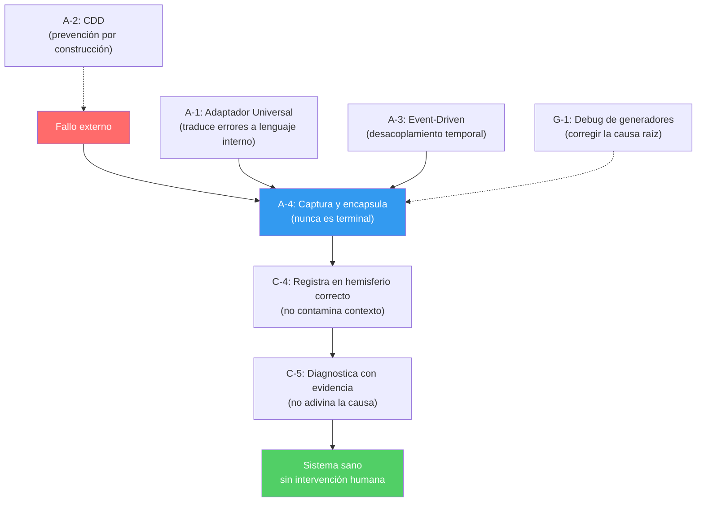

# Resumen: Manejo de Errores en la Ingeniería No Lineal (INL)

> *"La Ingeniería Lineal automatiza el caso de éxito. La Ingeniería No Lineal automatiza el caso de fallo."*

---

## Filosofía Central

La INL parte de una premisa radical: **el error no es una excepción — es la norma**. Mientras la ingeniería tradicional diseña sistemas asumiendo que todo funcionará y luego "maneja" los fallos como accidentes, la INL **asume de origen que todo fallará** y construye la resiliencia como propiedad estructural del sistema.

El objetivo final es el **Abandono Preparado**: un sistema tan maduro que puede operar sin intervención humana indefinidamente, sanando sus propios fallos y procesando sus propias colas de error.

---

## Los 6 Pilares del Manejo de Errores INL

### 1. 🛡️ Trauma Empaquetado — Patrón A-4 (DLQ)
**Archivo:** [patrones-auto-healing.md](file:///C:/Proyectos/Claude/Claude%20code/Repositorio%20Ingenieria%20No%20Lineal/02-framework/patrones-auto-healing.md)
**Ley Constitucional:** Ley F-3

> **Principio:** El error nunca es terminal para el sistema.

Cuando ocurre un fallo externo (timeout 503, gateway caído, API hostil), el sistema ejecuta una secuencia de 4 pasos:

| Paso | Acción | Resultado |
|------|--------|-----------|
| **Captura** | Registra payload original + estado de transacción + metadatos del error | Información completa del fallo |
| **Encapsula** | Sella la información en un contenedor atómico — el "Trauma Empaquetado" | Fallo aislado e inmutable |
| **Deposita** | Inserta el trauma en la **Cola de Errores de Nivel 2 (DLQ)** | Error catalogado para sanación |
| **Continúa** | El proceso principal ignora la anomalía individual y sigue | Cero impacto en UX |

**El usuario no ve un error fatal.** Ve un estado intermedio honesto: *procesamiento diferido*.

#### Mecanismo de Sanación Automática
Un **Agente de Recuperación Asíncrona** opera en ciclos de baja demanda (madrugadas, ventanas sin tráfico) y patrulla la DLQ:
- **Causa transitoria** (infra del proveedor) → reinyecta la transacción en el punto exacto de fallo
- **Causa lógica** (error de negocio) → cataloga para revisión humana **sin bloquear el sistema**

> [!IMPORTANT]
> La analogía biológica es clave: el sistema redirige la "asfixia" hacia su "sistema linfático" (DLQ) mediante introspección. No colapsa — encapsula y continúa.

---

### 2. 🔌 Adaptador Universal — Patrón A-1
**Archivo:** [a1-adaptador-universal.md](file:///C:/Proyectos/Claude/Claude%20code/Repositorio%20Ingenieria%20No%20Lineal/03-patrones/a1-adaptador-universal.md)
**Ley Constitucional:** Ley F-5

> **Principio:** Los errores externos se traducen al lenguaje semántico interno del sistema.

El Adaptador es el **único componente** que habla con servicios externos. Su responsabilidad clave en el manejo de errores:

#### Interpretación Semántica de Errores
Los errores del servicio externo **no se propagan como excepciones genéricas**. Se mapean a un lenguaje interno:

```javascript
const ERROR_MAP = {
  402: { tipo: 'CREDITOS_AGOTADOS',   reintentable: false, alerta: true  },
  429: { tipo: 'RATE_LIMIT',          reintentable: true,  alerta: false },
  503: { tipo: 'SERVICIO_CAIDO',      reintentable: true,  alerta: true  },
};
```

- El código de negocio **nunca reacciona a códigos HTTP**
- Reacciona a **intenciones semánticas** del dominio propio
- Cuando aparece un error nuevo → se agrega una entrada a la tabla, no se modifica código

#### Punto de Observabilidad
El Adaptador es el lugar natural para:
- Instrumentar métricas de latencia/errores del proveedor
- Implementar **circuit breakers**
- Aplicar **rate limiting proactivo**
- Alimentar el sistema de traumas empaquetados (A-4)

---

### 3. ⚡ Coordinación Event-Driven — Patrón A-3
**Archivo:** [a3-event-driven.md](file:///C:/Proyectos/Claude/Claude%20code/Repositorio%20Ingenieria%20No%20Lineal/03-patrones/a3-event-driven.md)

> **Principio:** Los fallos parciales no rompen la experiencia del usuario.

La arquitectura event-driven desacopla **temporalmente** la intención del resultado:

| Fase | Acción | Duración |
|------|--------|----------|
| **Registro de Intención** | Persiste la solicitud, devuelve tracking ID | <1 segundo |
| **Procesamiento** | Motor asíncrono invoca servicio, maneja fallos | Minutos |
| **Emisión de Resultado** | Evento realtime al frontend | <1 segundo |

Cuando el proveedor falla durante el procesamiento:
- El estado pasa a `fallido` + se registra el trauma
- **A-4 (Trauma Empaquetado) se activa automáticamente**
- El usuario solo ve "procesando" prolongado, **nunca un error fatal**

#### Anti-patrón crítico: Reintentos sin idempotencia
La INL exige **verificación de idempotencia obligatoria** antes de cada reintento. El patrón A-4 maneja los reintentos de forma disciplinada para evitar duplicados y corrupción.

---

### 4. 🔍 Debugging de Generadores — Patrón G-1
**Archivo:** [g1-debugging-generadores.md](file:///C:/Proyectos/Claude/Claude%20code/Repositorio%20Ingenieria%20No%20Lineal/03-patrones/g1-debugging-generadores.md)
**Ley Constitucional:** Ley O-3

> **Principio:** Si un error aparece en 3+ lugares, no es un bug — es una falla en el generador.

Este es el pilar más filosófico del manejo de errores INL: los errores **no se parchean individualmente**. Se identifica el mecanismo que los genera y se corrige una sola vez.

#### Flujo operativo

```
Error en A → ¿Hay 3+ instancias similares? 
                │
                ├── NO → Parchar normalmente
                │
                └── SÍ → PAUSAR. Identificar el generador:
                          ├── ¿Plantilla de código? → Corregir plantilla
                          ├── ¿Prompt de IA? → Corregir prompt
                          ├── ¿Convención documental? → Corregir texto
                          └── ¿Patrón arquitectónico? → Reescribir patrón
```

#### Resultado empírico documentado
- Corregir una plantilla: **~15 minutos**
- Corregir 50 instancias una por una: **~12 horas**
- Caso documentado: 215+ defectos compartían un mismo generador → corregido en **una jornada** (estimado lineal: semanas)

#### Los 4 Anti-patrones del debugging

| Anti-patrón | Descripción | Solución INL |
|-------------|-------------|-------------|
| Síndrome del parche heroico | Confundir actividad con productividad | Medir parches *evitados*, no escritos |
| Falso generador común | Identificar generador con solo 2 instancias | Umbral estricto de 3 + análisis del mecanismo |
| Generador corregido sin re-auditoría | Corregir el generador pero no las instancias viejas | Flujo completo obligatorio: generador + auditoría masiva |
| Micro-optimización del generador | Perfeccionar infinitamente el generador | Regla de salida clara |

---

### 5. 🧠 Diagnóstico con Evidencia — Patrones C-4 y C-5
**Archivo:** [patrones-auto-healing.md](file:///C:/Proyectos/Claude/Claude%20code/Repositorio%20Ingenieria%20No%20Lineal/02-framework/patrones-auto-healing.md)

Dos patrones cognitivos que gobiernan **cómo se diagnostican** los errores:

#### C-4 — Memoria Bitemporal (Separación de Hemisferios)

| Hemisferio | Contenido | Naturaleza |
|-----------|-----------|------------|
| **A — Sesión** | Contexto de la interacción actual | Efímero, personal |
| **B — Global** | Historial de caídas, patrones de error, docs técnicos | Persistente, compartido, inmutable |

**Resultado:** cuando un usuario reporta un fallo, el sistema puede decir con precisión: *"Esto no es un error de tu configuración — es un incidente global del proveedor X detectado hace 10 minutos."* Sin contaminación cruzada entre contextos.

#### C-5 — ReAct Zero-Trust (Constitución XML para agentes)

```xml
<diagnostic_protocol>
  <step id="1" tool="tool_telemetria_sistema" required="true">
    ¿Hay traumas empaquetados relacionados con este síntoma?
  </step>
  <step id="2" tool="tool_escaner_persistencia" required="true">
    ¿Cuál es el estado real del registro en la base de datos?
  </step>
</diagnostic_protocol>

<security_bound>
  PROHIBIDO: establecer conclusiones si existe discrepancia
  entre la telemetría y el grafo de conocimiento.
  Acción requerida: derivar a supervisión humana con reporte completo.
</security_bound>
```

> [!WARNING]
> La regla de oro: **un agente que solo habla cuando tiene evidencia es infinitamente más valioso que uno que siempre tiene una respuesta.** Si la evidencia es contradictoria, el agente escala — no decide solo.

---

### 6. 🏗️ Blindaje en la Capa Física — Patrón A-2 (CDD)
**Archivo:** [a2-constraint-driven-development.md](file:///C:/Proyectos/Claude/Claude%20code/Repositorio%20Ingenieria%20No%20Lineal/03-patrones/a2-constraint-driven-development.md)
**Ley Constitucional:** Ley F-2

> **Principio:** Las restricciones críticas viven en la base de datos, no en el código. El error de seguridad se previene por construcción, no por disciplina.

Mecanismos:
- **RLS (Row Level Security):** aislamiento de datos a nivel atómico
- **Restricciones CHECK/UNIQUE/NOT NULL:** invariantes matemáticos inviolables
- **Triggers de auditoría:** registro automático e inmutable

> *"Si la regla es importante, vive en la base. Si vive solo en el código, no es importante."*

---

## La Cadena Completa de Resiliencia: L0 → L5

La INL define **6 niveles progresivos** de madurez en el manejo de errores:

```
L0 — Tolerancia al fallo        → el proceso no muere ante el primer error
L1 — Persistencia del trauma    → el error se almacena en la capa de datos
L2 — Notificación activa        → el operador humano es informado
L3 — Ticketing estructurado     → se genera un registro de incidente formal
L4 — Reintento automático (DLQ) → la transacción fallida se reinyecta sola
L5 — Auto-Reparación Cognitiva  → un agente IA lee el incidente, diagnostica
                                   la causa raíz, escribe el parche y abre el PR
```

**Archivo:** [agente-reparador-autonomo-l5.md](file:///C:/Proyectos/Claude/Claude%20code/Repositorio%20Ingenieria%20No%20Lineal/07-avances/agente-reparador-autonomo-l5.md)

### El Agente Reparador Autónomo (L5)

El nivel más avanzado: un agente cognitivo que opera sobre 3 grafos de conocimiento (topología, errores, operador) en **modo lectura exclusiva** y produce un Pull Request como único output.

#### Pipeline de 8 nodos deterministas

```
Node 1: CARGAR_CONTEXTO       → Stack trace, fingerprint, componente
Node 2: MAPEAR_ARQUITECTURA   → Consultar grafo de topología
Node 3: BUSCAR_HISTORIAL      → ¿Este error ya ocurrió antes?
Node 4: DIAGNOSTICAR          → Hipótesis basada en EVIDENCIA
Node 5: GENERAR_FIX           → Escribir el parche
Node 6: VALIDAR_FIX           → ¿Viola reglas del grafo? (max 5 intentos)
Node 7: PUBLICAR_PR           → Rama fix/incidente-{N}
Node 8: NOTIFICAR             → Comentar en el incidente
```

#### Líneas Rojas (Zero-Violation)
1. Jamás merge directo — el humano aprueba siempre
2. Jamás push a la rama principal
3. Jamás modificar credenciales o variables de entorno
4. Jamás ignorar una regla `GOBERNADO_POR` del grafo
5. Jamás más de 5 iteraciones — si no converge, escala
6. Jamás operar sin evidencia instrumental

#### Salvaguarda Anti-Bucle
- Máximo 5 iteraciones por nodo antes de escalar
- AbortSignal a los 7m30s
- Si no converge: comenta "Requiere intervención manual" y cierra el ciclo

---

## El Exocórtex como Sistema de Memoria de Errores

La INL no solo propone manejar errores en runtime — propone **institucionalizar los aprendizajes** de cada error en un sistema de memoria persistente:

### REGISTRO_TRAUMAS.md
**Archivo:** [REGISTRO_TRAUMAS.md](file:///C:/Proyectos/Claude/Claude%20code/Repositorio%20Ingenieria%20No%20Lineal/REGISTRO_TRAUMAS.md)

Cada decisión crítica, cada anti-patrón detectado, cada error sistémico resuelto se registra con:
- **Tipo** (Ley nueva | Decisión fundada | Anti-patrón resuelto)
- **Contexto** completo
- **Opciones evaluadas** con pros/contras
- **Razonamiento** citando ley o principio INL
- **Consecuencia** concreta

> [!TIP]
> Esto convierte cada error en capital institucional. Un agente futuro que encuentre el mismo problema puede consultar la cura documentada sin re-descubrirla.

---

## La Relación entre los Patrones (Cadena de Resiliencia)



---

## KPIs del Manejo de Errores

| Indicador | Valor saludable | Valor de alarma |
|-----------|----------------|-----------------|
| Bugs similares antes de buscar el patrón sistémico | ≤ 3 | > 5 |
| Tiempo de debugging sin aplicar parche sistémico | < 2 horas | > 2 horas |
| Mismo error en 3+ lugares sin identificar generador | 0 | > 0 |
| Errores que despiertan humanos a las 3am | 0 (DLQ los absorbe) | > 0 |

**Archivo:** [antipatrones-y-kpis.md](file:///C:/Proyectos/Claude/Claude%20code/Repositorio%20Ingenieria%20No%20Lineal/05-evidencia/antipatrones-y-kpis.md)

---

## Resumen Ejecutivo

| Capa | Patrón | Pregunta que responde | Principio clave |
|------|--------|-----------------------|-----------------|
| **Prevención** | A-2 CDD | ¿Cómo evitar que el error ocurra? | Restricciones en la capa física |
| **Aislamiento** | A-1 Adaptador | ¿Cómo traducir errores externos? | Un componente, semántica interna |
| **Desacoplamiento** | A-3 Event-Driven | ¿Cómo que el error no rompa la UX? | Intención separada de Resultado |
| **Captura** | A-4 DLQ | ¿Qué hacer cuando falla? | Empaquetar, depositar, continuar |
| **Diagnóstico** | C-4 + C-5 | ¿Cómo diagnosticar sin adivinar? | Hemisferios separados + evidencia |
| **Corrección sistémica** | G-1 Generadores | ¿Cómo que no vuelva a pasar? | Corregir la causa, no el síntoma |
| **Auto-reparación** | L5 Agente | ¿Puede curarse solo? | Agente autónomo + HITL para merge |
| **Memoria** | Exocórtex | ¿Cómo aprender del error? | REGISTRO_TRAUMAS institucional |

> [!NOTE]
> La diferencia filosófica fundamental: la ingeniería lineal trata los errores como excepciones al caso de éxito. La INL diseña el sistema **desde el caso de fallo** y el éxito es la consecuencia natural de un sistema que sabe sobrevivir.
