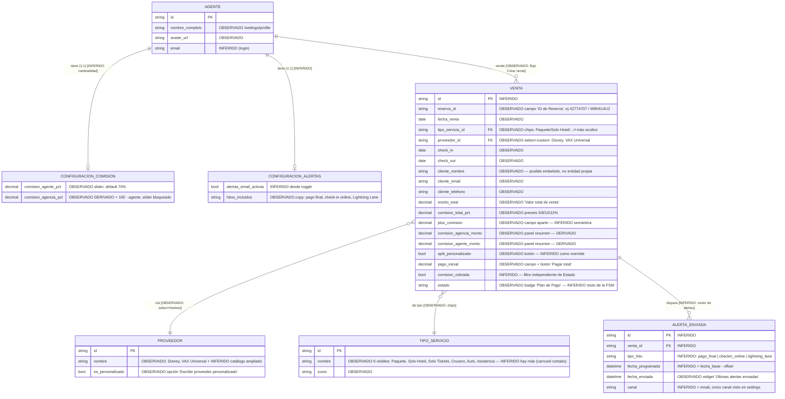
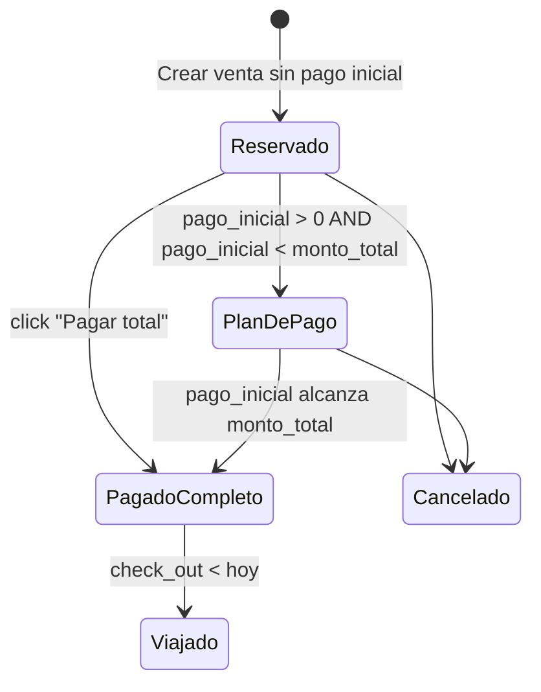
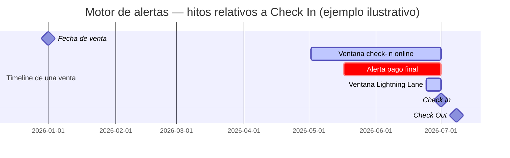

# Modelo de dominio implícito — Venselo (app.venselo.com)

> Software de gestión para agentes de viajes especializados en Disney.
> Reconstrucción a partir de evidencia observada (screenshots reales de una cuenta) + investigación pública + inferencia razonada.

**Convención de etiquetas usada en todo el documento:**
- **[OBSERVADO]** — viene literal de los screenshots del operador (Fuente A). Se trata como hecho.
- **[PÚBLICO]** — viene de investigación web (Fuente B). Se cita la fuente.
- **[INFERIDO]** — construcción propia a partir de lo observado/público + conocimiento de dominio (SaaS de viajes, políticas Disney). Nunca se presenta como hecho verificado.

---

## 0. Nota metodológica sobre Fuente B (investigación pública)

Búsqueda ejecutada: `venselo.com`, `app.venselo.com`, "Venselo" + software/CRM/agentes de viaje/Disney/pricing/reviews, variantes de dominio (`.io`, `.app`), LinkedIn, Capterra, G2, Product Hunt, Host Agency Reviews, Trustpilot, App Store/Google Play.

**Resultado: Venselo prácticamente no tiene huella pública indexada.**
- `https://www.venselo.com` → error DNS (no resuelve).
- `https://venselo.com` → HTTP 404.
- `https://app.venselo.com` → responde pero sin contenido extraíble por fetch de texto (consistente con una SPA autenticada que no renderiza server-side; no se pudo confirmar landing pública).
- Cero apariciones en Capterra, G2, Product Hunt, Host Agency Reviews (que sí lista >40 softwares de agencias de viaje, incluyendo un competidor Disney-específico: **MouseIQPlanner**), Trustpilot, LinkedIn.
- Cero menciones en foros de agentes Disney indexados por el buscador.

**Conclusión de Fuente B: es un producto de muy bajo perfil público — probablemente distribuido boca a boca dentro de comunidades cerradas de agentes Disney (host agencies, grupos de Facebook privados), no vía marketing digital indexable.** Esto en sí mismo es un dato: no hay pricing público, no hay landing con feature-list, no hay demo pública. Todo lo que sigue sobre features/pricing/posicionamiento de Venselo es **[OBSERVADO]** (Fuente A) o **[INFERIDO]** — no hay material **[PÚBLICO]** propio de Venselo que citar.

Como contexto de categoría (no sobre Venselo, sino sobre competidores directos en el mismo nicho, útil para la Sección 4):
- **[PÚBLICO]** Travel Mouse CRM ("el CRM #1 para agentes de viaje Disney", travelmousecrm.com) ofrece: perfiles de cliente con afiliaciones/membresías/familiares, tracking de bookings/depósitos/pagos con alertas diarias de vencimientos, reportes de comisión, tareas con recordatorios, plantillas de email, portal de cliente con itinerario compartible y checklist automatizado, documentos fiscales automatizados, mensajería interna entre agentes de una misma agencia. Precio: US$10-20/usuario/mes.
- **[PÚBLICO]** MouseIQPlanner (listado en hostagencyreviews.com/travel-agency-software) — nombre sugiere herramienta de planificación Disney-específica; no se investigó en profundidad (fuera de alcance del pedido).
- **[PÚBLICO]** GoldenLion "CRM for Disney Vacation Planner" (sobre Zoho Creator) — gestiona leads, clientes, viajes, huéspedes, reservas con proveedores y pagos.

Estos tres confirman que Venselo compite en una **categoría establecida** (CRM/gestión vertical para agentes Disney/Universal) con jugadores que sí exponen features que Venselo, en lo observado, no muestra (portal de cliente, tareas manuales, mensajería de equipo) — insumo directo para la Sección 4.

---

## 1. Diagrama de entidades inferido

### 1.1 Diagrama ER (mermaid)



### 1.2 Qué es almacenado vs. derivado/calculado

| Campo | Naturaleza | Base |
|---|---|---|
| `Venta.monto_total`, `comision_total_pct`, `plus_comision`, `pago_inicial` | **Almacenado** | [OBSERVADO] son inputs del formulario |
| `Venta.comision_agencia_monto`, `comision_agente_monto` | **Calculado** (panel "Resumen" en vivo) | [OBSERVADO] — se recalculan mientras se tipea; INFERIDO si se persisten como snapshot al guardar o se recalculan siempre desde el % vigente (ver §2.3) |
| Overview → "Cantidad de ventas" | **Calculado** | `COUNT(Venta)` — [INFERIDO] rango temporal no observado (¿todo el histórico? ¿año en curso?) |
| Overview → "Total vendido" | **Calculado** | `SUM(Venta.monto_total)` |
| Overview → "Comisión cobrada" / "NO cobrada" | **Calculado**, complementarios | ver §2.1 |
| Overview → "Costo promedio de venta" | **Calculado** | `Total vendido / Cantidad de ventas` (verificado algebraicamente: 26866/8 ≈ 3358) |
| Overview → "Viajando ahora" | **Calculado, en vivo** | `COUNT(Venta) WHERE check_in <= HOY <= check_out` |
| `Estado` badge | Probablemente **derivado** de otros campos (pago_inicial vs monto_total, fechas) más que tecleado a mano | [INFERIDO] — ver §2.2 |
| `CONFIGURACION_COMISION.comision_agencia_pct` | **Derivado puro** | [OBSERVADO] slider bloqueado con candado = 100 − agente |
| `PROVEEDOR`, `TIPO_SERVICIO` | Catálogo/enum **almacenado** con escape hatch de texto libre (solo Proveedor) | [OBSERVADO] |

### 1.3 Ambigüedad estructural clave (marcada explícita)

**¿"Reserva" es una entidad separada de "Venta", o es el mismo registro?** [INFERIDO — sin evidencia de lo contrario] El modal "Crear venta" tiene una sección RESERVA con "ID de Reserva", pero esa misma columna se llama "Reserva" en la tabla de `/sales`. No hay pantalla `/reservations` independiente, ni evidencia de que una Reserva pueda tener múltiples Ventas (ej. upsell o modificación post-venta) o de que una Venta referencie una Reserva preexistente. **Modelo más probable: Venta y "Reserva" son el mismo registro** — "Reserva" es solo el nombre de la sub-sección del formulario y de la columna, no una entidad normalizada aparte. Si esto es incorrecto, es el punto de mayor impacto en todo el resto del diagrama.

**¿"Cliente" es una entidad normalizada?** [INFERIDO, con evidencia negativa] No hay ícono de navegación "Clientes" entre los 6 observados (overview, ventas, reportes/documentos, alertas, settings, perfil). Esto sugiere que Cliente vive **embebido dentro de Venta** (nombre+email+teléfono se re-tipean por cada venta) en vez de ser una entidad con su propia lista/historial. Si un mismo cliente compra dos veces, probablemente no hay deduplicación ni vista 360° del cliente — ver Sección 4.

---

## 2. Reglas de negocio inferidas

### 2.1 Cálculo de los KPIs del overview

| KPI | Fórmula inferida | Confianza |
|---|---|---|
| Cantidad de ventas | `COUNT(Venta)` en el período mostrado | Alta en la fórmula, **[INFERIDO]** el rango temporal (no se observó selector de fecha en overview) |
| Total vendido | `SUM(monto_total)` | Alta |
| Comisión cobrada | `SUM(comision_total_monto) WHERE comision_cobrada = true` | Alta — consistente con que el submenú de filtros de `/sales` lista "Comisión cobrada" como filtro **separado** de "Estado", es decir, es un flag propio del registro, no un valor derivado del badge de Estado |
| Comisión NO cobrada | `SUM(comision_total_monto) WHERE comision_cobrada = false` | Alta — es el complemento algebraico exacto: en la cuenta observada, comisión cobrada = 0 y comisión NO cobrada = 1746, consistente con que **ninguna** de las 8 ventas tiene el flag en `true` todavía |
| Costo promedio de venta | `Total vendido / Cantidad de ventas` | **Verificada por aritmética**: 26.866 / 8 = 3.358,25 ≈ 3358 observado. Nota: el label dice "costo" pero semánticamente es **ticket promedio de venta** (valor, no costo del agente) |
| Viajando ahora | `COUNT(Venta) WHERE check_in <= HOY AND check_out >= HOY` | Alta — la copy lo confirma ("clientes actualmente de viaje") |

### 2.2 La máquina de estados de "Estado" (`Plan de Pago` y vecinos)

Solo se observó un valor: **"Plan de Pago"**. El resto es **[INFERIDO]** por diseño típico de venta con depósito + saldo, y por la presencia de los campos "Pago inicial" + botón "Pagar total" en el formulario:



Interpretación: **"Plan de Pago"** = pago inicial registrado pero `pago_inicial < monto_total` → el cliente está pagando en cuotas hacia el proveedor (Disney permite planes de pago hasta la fecha de pago final). Estados hermanos inferidos: `Reservado` (sin pago o solo reserva confirmada), `Pagado Completo`, `Viajado`/`Completado`, `Cancelado`. **No hay evidencia directa de estos últimos 4** — solo se infiere su necesidad lógica dado el resto del formulario.

**Importante:** `Estado` (ciclo del viaje/pago del cliente) y `comision_cobrada` (si el proveedor ya liquidó la comisión al agente) son **dos dimensiones independientes** — el filtro de `/sales` las separa explícitamente. Un viaje puede estar "Pagado Completo" por el cliente y aun así tener comisión NO cobrada por el agente (el proveedor paga comisión con delay, típicamente post-viaje).

### 2.3 Split de comisión y "Plus comisión"

- **Split base**: definido en `/settings/sales` — `comision_agente_pct` (slider editable, default 70%) y `comision_agencia_pct` (candado, = 100% − agente). **[OBSERVADO]**
- **Override por venta**: botón "Split personalizado" en el modal de creación — **[INFERIDO]** permite fijar un split distinto al default global para esa venta puntual (ej. una venta grande donde el agente negoció mejor comisión, o un colaborador externo).
- **Snapshot vs. join en vivo** — **[INFERIDO, ambigüedad no resoluble sin acceso al backend]**: lo financieramente correcto es que `comision_agencia_monto`/`comision_agente_monto` se **persistan como snapshot** al crear la venta (para que si el agente cambia su % general seis meses después, el historial de ventas pasadas no se recalcule solo). El panel "Resumen" en vivo del modal sugiere que el cálculo ocurre client-side al tipear, pero eso no dice nada sobre qué se persiste.
- **"Plus comisión"** — **[INFERIDO, confianza media]**: campo separado de "Comisión total" (que es %). La interpretación más consistente con el dominio es un **monto fijo adicional** por fuera del % estándar — típicamente incentivos/bonos del proveedor (Disney paga bonos de venta por volumen o por temporada) o un ajuste manual que el agente negoció aparte y no quiere mezclar con el % base. Interpretación alternativa (menos probable, sin evidencia de servicios add-on como seguro de viaje en el formulario): comisión de servicios adicionales vendidos junto con el paquete.

---

## 3. El motor de alertas (la pieza más importante)

### 3.1 Qué dice la evidencia observada

- `/settings/sales`: *"Alertas por email: Recibí recordatorios por email antes de fechas clave como **pago final, check-in online y Lightning Lane**."* — **[OBSERVADO]**, texto literal. Nótese la primera persona ("Recibí") → **el destinatario del email es el agente, no el cliente final** — esto es una alerta operativa interna, no una comunicación cliente-facing.
- Overview: **"Próximas alertas (5 días)"** (ventana móvil hacia adelante) y **"Últimas alertas enviadas"** (log histórico) son widgets **separados** → confirma que existen dos vistas distintas de un mismo concepto: ocurrencias futuras calculadas vs. envíos ya ejecutados.
- `/alerts`: calendario mensual con días clickeables, navegación mes a mes — sugiere que cada alerta (futura o pasada) se posiciona en un día del calendario, es decir, la unidad mínima de la alerta es **fecha + tipo de hito + venta asociada**.

### 3.2 Fechas base disponibles en el modelo

De los campos observados en "Crear venta", las únicas fechas capturadas por el usuario son:

| Fecha capturada | Campo |
|---|---|
| Fecha de venta | `Venta.fecha_venta` |
| Check In | `Venta.check_in` |
| Check Out | `Venta.check_out` |

**No existe un campo explícito "Fecha de pago final" en el formulario observado.** Esto es un hallazgo relevante: implica que el hito "pago final" **no se teclea a mano por venta**, sino que se **deriva por regla** a partir de `check_in` (y probablemente del `proveedor`/`tipo_servicio`), con un offset fijo — no expuesto en ninguna pantalla de configuración observada (no hay `/settings/alerts` con reglas por proveedor).

### 3.3 Reconstrucción de los 3 hitos (cada uno = `fecha_base − offset_días`)



| Hito | Fecha base | Offset inferido | Fundamento | Confianza |
|---|---|---|---|---|
| **Pago final** | `check_in` | **[INFERIDO]** ~30-45 días antes (varía por tipo de paquete/temporada en las políticas reales de Disney — no verificado contra spec vigente) | Disney exige liquidar el saldo total antes de una fecha límite previa al viaje; sin campo propio en el form, debe calcularse | Media — el *concepto* es sólido (dominio de viajes lo exige), el *offset exacto* es **[ASSUMED_PENDING_VERIFY]** |
| **Check-in online** | `check_in` | **[INFERIDO]** ventana de varias semanas antes (en la práctica del sector, del orden de 30-60 días) | Los resorts/paquetes habilitan auto-check-in con antelación; el agente debe recordarle al cliente hacerlo | Media — offset exacto **[ASSUMED_PENDING_VERIFY]** |
| **Lightning Lane** | `check_in` | **[INFERIDO]** ventana corta, del orden de días (no semanas) antes del check-in | Los sistemas de selección de atracciones con antelación (reemplazo del viejo FastPass+) se habilitan cerca de la fecha de viaje, con trato preferencial a huéspedes de resort | Media — offset exacto **[ASSUMED_PENDING_VERIFY]**, y depende de si el `proveedor` es Disney específicamente (un "Lightning Lane" no aplica a VAX Universal) |

**Regla de scoping implícita** — **[INFERIDO]**: el hito "Lightning Lane" solo tiene sentido para `proveedor = Disney`. Esto implica que el motor de alertas **no es un único set de reglas globales**, sino que debe tener, como mínimo, una tabla de reglas parametrizada por `proveedor` (y probablemente por `tipo_servicio`, ya que "check-in online"/"Lightning Lane" no aplican igual a "Solo Tickets" que a "Paquete"). No hay evidencia de que el usuario pueda editar estos offsets — probablemente están **hardcodeados en el backend**, ajustados a las políticas de Disney/VAX que Venselo mantiene manualmente.

### 3.4 Pseudocódigo del motor (reconstrucción, todo INFERIDO)

```
para cada Venta activa (estado != Cancelado):
  para cada regla en TABLA_REGLAS_ALERTAS (filtrada por venta.proveedor, venta.tipo_servicio):
    fecha_hito = venta.check_in - regla.offset_dias
    si fecha_hito no está ya en AlertaEnviada(venta, regla.tipo_hito):
      si fecha_hito == hoy:
        enviar_email(agente, plantilla(regla.tipo_hito), venta)
        registrar AlertaEnviada(venta, regla.tipo_hito, hoy)
      si fecha_hito está en rango [hoy, hoy+5]:
        incluir en widget "Próximas alertas (5 días)"
```

**Supresión inferida (no observada, pero necesaria para que el producto no sea ruidoso):** si `Venta.estado` ya resolvió la condición (ej. el hito es "pago final" pero la venta ya está en `PagadoCompleto`), la alerta debería suprimirse. No hay evidencia directa de esto — es una hipótesis de diseño razonable, no un hecho verificado.

### 3.5 Lo que el motor de alertas NO puede estar haciendo (con la evidencia disponible)

- No puede estar usando una fecha de pago final *real* provista por Disney (esa fecha exacta depende de reglas de Disney que varían por temporada/tipo de reserva y no es un simple resta de días fija) — a menos que exista un campo oculto no visto en los screenshots. **Esto es el mayor riesgo de precisión del feature tal como está inferido**: si el offset es fijo y genérico, las alertas de "pago final" pueden estar desalineadas con la fecha real que impone Disney en reservas específicas.
- No hay evidencia de que el cliente final reciba estas alertas — son 100% internas al agente (ver §3.1).

---

## 4. Qué NO tiene Venselo (huecos evidentes)

Basado en ausencia en los 6 íconos de navegación observados y en los campos del modal de creación:

| Hueco | Evidencia de ausencia | Comentario |
|---|---|---|
| **Multi-cliente por reserva / acompañantes** | El formulario solo captura 1 nombre + 1 email + 1 teléfono. No hay campo "cantidad de viajeros" ni lista de acompañantes/edades (relevante para pricing de niños en Disney) | [OBSERVADO ausencia] |
| **Entidad Cliente normalizada / CRM 360°** | Sin ícono "Clientes" en el nav; el cliente se re-tipea por venta | [OBSERVADO ausencia — INFERIDO consecuencia: sin deduplicación ni historial consolidado por cliente] |
| **Pagos/cuotas más allá del pago inicial** | Solo existe "Pago inicial" + botón "Pagar total"; no hay calendario de cuotas ni registro de pagos subsiguientes visible en el formulario, pese a que el estado "Plan de Pago" implica pagos futuros | [OBSERVADO ausencia en el formulario] |
| **Documentos / vouchers** | No se observó ninguna sección de adjuntos, confirmaciones PDF ni vouchers de reserva | [OBSERVADO ausencia] |
| **Tareas / checklist operativo manual** | No hay "crear tarea" observado (a diferencia de Travel Mouse CRM, competidor directo, que sí lo tiene) | [OBSERVADO ausencia] + [PÚBLICO comparativo] |
| **Comunicación con el cliente (portal, itinerario, templates)** | Las alertas son solo al agente (1ra persona "Recibí"); no hay portal de cliente ni plantillas de email salientes visibles | [OBSERVADO ausencia] + [PÚBLICO: Travel Mouse CRM sí lo ofrece] |
| **Multi-moneda / ARS** | Todo en US$; sin selector de moneda en ningún screen | [OBSERVADO ausencia] — limitante para reportar rentabilidad en moneda local si el agente opera desde LatAm |
| **Multi-agente en una agencia (equipo)** | Config de comisión está en singular ("Comisión del agente", perfil individual); sin ícono "Equipo"/"Agentes" en el nav de 6 íconos | [OBSERVADO ausencia] — sugiere que Venselo es de uso **individual por agente**, no un panel de agencia con varios agentes bajo un mismo tenant |
| **Gestión de leads / pipeline pre-venta** | El flujo arranca directo en "Crear venta" (ya hay una venta concretada); no hay etapa de "cotización" o "prospecto" | [OBSERVADO ausencia] |
| **Integración/sync con sistemas de proveedores (Disney, VAX)** | "Proveedor" es un select+texto libre, no una integración; existe "Importar Ventas" (probablemente CSV) pero no evidencia de sync automático | [OBSERVADO: import manual, no API] |
| **Configuración de reglas de alerta por proveedor/tipo de servicio** | No se observó ninguna pantalla `/settings/alerts` con offsets editables | [OBSERVADO ausencia] — refuerza que los offsets del motor de alertas (§3) están hardcodeados |

---

## 5. Tabla de decisiones para NOSOTROS

**Marco asumido**: estamos evaluando qué partes de este modelo de dominio adoptar para un **asistente conversacional que ejecuta acciones** (perfil Copiloto: tool-calling + Temporal durable + memoria), no un CRUD de formularios. Esto es una hipótesis de encuadre mía para poder decidir — si el objetivo real es otro (ej. evaluar Venselo como competidor sin intención de construir un vertical propio), la tabla igual sirve como insumo pero el "por qué" de cada fila cambia.

| Entidad / Regla | Decisión | Por qué |
|---|---|---|
| **Venta** (registro central con reserva+financiero embebido) | **Adoptar modificado** | El campo-set está validado en producción (probado con datos reales, 8 ventas ≠ demo). Modificación: normalizar Cliente como entidad propia (ver fila siguiente) y exponer la creación vía conversación/tool-call, no modal de 4 secciones — el usuario debería poder decir "cargá una venta de paquete Disney para Juan, check-in 3 de agosto" y que el asistente complete el resto vía diálogo, no formulario. |
| **Cliente embebido, sin entidad propia** | **Descartar ese patrón** | Es el hueco más caro de Venselo (§4). Un asistente conversacional necesita "¿qué le vendí a Juan?" / "recordame el historial de María" — imposible sin Cliente normalizado con índice de búsqueda. Cero costo extra construirlo bien desde el día 0 (regla "cero fricción para escalar"). |
| **Split comisión: default global (slider) + override por venta ("Split personalizado")** | **Adoptar tal cual** | Patrón simple y correcto: default + override local, sin sobreingeniería. Encaja directo con el modelo `ConfigMercadoPago`/tenant-config que ya existe en Copiloto. |
| **Snapshot vs. recálculo en vivo del split al momento de la venta** | **Adoptar modificado — forzar snapshot** | Corrección respecto a la ambigüedad de Venselo (§2.3): persistir el % vigente en el momento de la venta es la única opción financieramente correcta (auditoría, comisiones históricas inmutables). No dejarlo ambiguo. |
| **Proveedor: catálogo curado + texto libre** | **Adoptar tal cual** | Patrón correcto: cubre los proveedores frecuentes (Disney, VAX, cruceros) sin bloquear casos no previstos. Sin sobreingeniería. |
| **Estado como badge único mezclando pago + ciclo de viaje** | **Adoptar modificado — separar en 2 máquinas de estado** | Mezclar "pago del cliente" y "ciclo del viaje" en un enum monolítico es deuda de diseño (Venselo aparenta tenerla, aunque no está 100% confirmado — §2.2). Separar boundaries explícitos: `EstadoPago` (Reservado→PlanDePago→PagadoCompleto) y `EstadoViaje` (Próximo→EnCurso→Completado→Cancelado) — más ordenado, más fácil de razonar para el LLM al decidir qué tool llamar. |
| **`comision_cobrada` como flag independiente del Estado** | **Adoptar tal cual** | Separación correcta entre "el cliente pagó" y "el proveedor liquidó comisión al agente" — son dos flujos de caja distintos y reales en el negocio. Buen boundary, sin sobreingeniería. |
| **Motor de alertas con offsets fijos hardcodeados por hito (pago final / check-in online / Lightning Lane)** | **Adoptar modificado** | El *concepto* (recordar hitos operativos derivados de check-in) es alto valor y directamente reusable con el motor de alertas/Schedule que Copiloto ya tiene (`copiloto-automatizaciones-recurrentes-candidato`, Temporal Schedule+signal). Modificación: (a) hacer los offsets **parametrizables** por proveedor/tipo de servicio en vez de hardcodeados — Venselo no lo permite (§4) y es la causa raíz más probable de alertas desalineadas; (b) el asistente conversacional debería **proponer la acción, no solo notificar** — ej. "el check-in online de Juan se habilita en 3 días, ¿querés que te arme el recordatorio o lo hago yo si tengo la integración?" en vez de un email pasivo. |
| **Alertas solo al agente (nunca al cliente final)** | **Adoptar modificado** | Mantener el caso base (alertar al agente), pero agregar la opción de que el asistente, con confirmación HITL, envíe el recordatorio directo al cliente (WhatsApp/email vía Composio) — es un vacío real de Venselo (§4) y encaja con el patrón "servicios plug-in Composio" que Copiloto ya tiene. |
| **Sin pipeline de leads/cotización previo a la venta** | **Descartar esa ausencia** | Es un hueco de negocio real, no una simplificación deliberada — un asistente conversacional es *particularmente* bueno para automatizar seguimiento de cotizaciones (recordatorios de follow-up, nurturing). Si se construye este vertical, incluir un estado `Cotización`/`Prospecto` antes de `Venta`. |
| **Sin gestión de documentos/vouchers** | **Descartar esa ausencia — agregar** | Encaja gratis con la integración Drive/Gmail que Copiloto ya tiene vía Composio: generar/organizar vouchers y confirmaciones sin trabajo adicional de research, solo de integración. |
| **Single-agente-por-cuenta (sin equipo/multi-agente en agencia)** | **Descartar esa limitación** | Copiloto ya es multitenant real (`TenantCtx`, aislamiento cross-tenant verificado con test adversarial — regla no negociable del proyecto, CLAUDE.md §3.7). Un vertical de agencias de viaje sin soporte multi-agente sería un retroceso arquitectónico respecto a lo que ya existe. |
| **Sin multi-moneda (todo US$)** | **Adoptar modificado** | Si el target incluye LatAm (coherente con el propio Copiloto, que ya integra MercadoPago/ARS), soportar multi-moneda desde el modelo de datos día 0 es cero-fricción ahora y carísimo retrofit después. |
| **"Eliminar todos los datos" vs. "Eliminar cuenta" (dos acciones destructivas distintas)** | **Adoptar tal cual** | Buen patrón UX genérico (reset de datos de prueba vs. baja de cuenta) — aplica a cualquier SaaS, no es específico del dominio de viajes. |
| **Import manual de ventas (CSV), sin integración con sistemas de proveedores** | **Adoptar modificado, como fallback — no como estrategia principal** | Mantener import manual como piso (rápido de construir, cero dependencia externa), pero si el vertical avanza, evaluar como candidato futuro una integración real con VAX/Disney (fuera de alcance de esta primera pasada — requeriría spike-first sobre si esas plataformas exponen algo integrable). |

---

## Resumen ejecutivo (para no releer todo)

Venselo modela el negocio del agente de viajes Disney alrededor de una **entidad única "Venta"** que fusiona reserva + cliente + financiero (probablemente sin normalizar Cliente ni Reserva por separado — inferencia con evidencia negativa, no confirmada). Los KPIs del overview son agregaciones/derivaciones directas y algebraicamente consistentes de esa tabla. El **estado "Plan de Pago"** sugiere una FSM de pago con al menos 3-4 estados hermanos no observados. El **motor de alertas** (la pieza más valiosa del producto) deriva "pago final", "check-in online" y "Lightning Lane" a partir de `check_in` con offsets que casi con certeza están **hardcodeados y no expuestos al usuario** — sin campo propio de "fecha de pago final" en el formulario, no hay otra fuente de la que puedan salir. Venselo es de **uso individual por agente** (sin equipo/multi-agente visible), sin CRM de clientes, sin pipeline de leads, sin portal de cliente ni documentos — huecos que un asistente conversacional con ejecución de acciones (a diferencia de un CRUD) puede cerrar con relativamente poco esfuerzo incremental dado lo que Copiloto ya tiene construido (multitenant, Composio, Temporal Schedule, memoria).

**Fuente B fue esencialmente estéril** — Venselo no tiene presencia pública indexable (sin landing indexada, sin pricing público, sin reviews en Capterra/G2/Host Agency Reviews). Todo el análisis de negocio descansa en Fuente A (screenshots reales) + inferencia de dominio, con los offsets exactos del motor de alertas marcados explícitamente como **[ASSUMED_PENDING_VERIFY]**.
